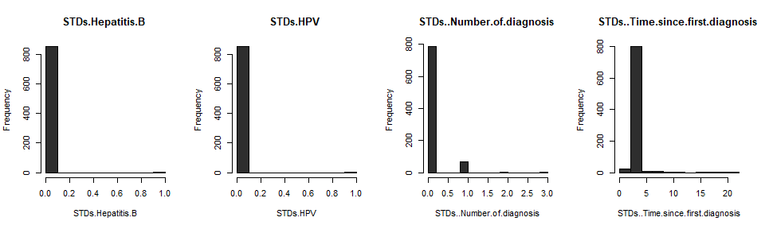

# Loading the Requisite Libraries

``` r
library(caret)
library(dplyr)
library(ggplot2)
library(RANN)
library(kernlab)
library(corrplot)
library(pander)
library(tidyverse)
library(MASS)
library(pROC)
library(factoextra)
library(MLmetrics)
```

# Reading in and Inspecting the Dataset

``` r
#read in the cervical cancer dataset
cervdat <- read.csv("risk_factors_cervical_cancer.csv", header=TRUE, 
                     stringsAsFactors = FALSE)
cervdat <- as.data.frame(apply(cervdat, 2, as.integer))

# remove unused columns
cervdat <- subset(cervdat, select = -c(Citology, Schiller, Hinselmann))  
str(cervdat) # inspect the dataset
```

    ## 'data.frame':    858 obs. of  33 variables:
    ##  $ Age                               : int  18 15 34 52 46 42 51 26 45 44 ...
    ##  $ Number.of.sexual.partners         : int  4 1 1 5 3 3 3 1 1 3 ...
    ##  $ First.sexual.intercourse          : int  15 14 NA 16 21 23 17 26 20 15 ...
    ##  $ Num.of.pregnancies                : int  1 1 1 4 4 2 6 3 5 NA ...
    ##  $ Smokes                            : int  0 0 0 1 0 0 1 0 0 1 ...
    ##  $ Smokes..years.                    : int  0 0 0 37 0 0 34 0 0 1 ...
    ##  $ Smokes..packs.year.               : int  0 0 0 37 0 0 3 0 0 2 ...
    ##  $ Hormonal.Contraceptives           : int  0 0 0 1 1 0 0 1 0 0 ...
    ##  $ Hormonal.Contraceptives..years.   : int  0 0 0 3 15 0 0 2 0 0 ...
    ##  $ IUD                               : int  0 0 0 0 0 0 1 1 0 NA ...
    ##  $ IUD..years.                       : int  0 0 0 0 0 0 7 7 0 NA ...
    ##  $ STDs                              : int  0 0 0 0 0 0 0 0 0 0 ...
    ##  $ STDs..number.                     : int  0 0 0 0 0 0 0 0 0 0 ...
    ##  $ STDs.condylomatosis               : int  0 0 0 0 0 0 0 0 0 0 ...
    ##  $ STDs.cervical.condylomatosis      : int  0 0 0 0 0 0 0 0 0 0 ...
    ##  $ STDs.vaginal.condylomatosis       : int  0 0 0 0 0 0 0 0 0 0 ...
    ##  $ STDs.vulvo.perineal.condylomatosis: int  0 0 0 0 0 0 0 0 0 0 ...
    ##  $ STDs.syphilis                     : int  0 0 0 0 0 0 0 0 0 0 ...
    ##  $ STDs.pelvic.inflammatory.disease  : int  0 0 0 0 0 0 0 0 0 0 ...
    ##  $ STDs.genital.herpes               : int  0 0 0 0 0 0 0 0 0 0 ...
    ##  $ STDs.molluscum.contagiosum        : int  0 0 0 0 0 0 0 0 0 0 ...
    ##  $ STDs.AIDS                         : int  0 0 0 0 0 0 0 0 0 0 ...
    ##  $ STDs.HIV                          : int  0 0 0 0 0 0 0 0 0 0 ...
    ##  $ STDs.Hepatitis.B                  : int  0 0 0 0 0 0 0 0 0 0 ...
    ##  $ STDs.HPV                          : int  0 0 0 0 0 0 0 0 0 0 ...
    ##  $ STDs..Number.of.diagnosis         : int  0 0 0 0 0 0 0 0 0 0 ...
    ##  $ STDs..Time.since.first.diagnosis  : int  NA NA NA NA NA NA NA NA NA NA ...
    ##  $ STDs..Time.since.last.diagnosis   : int  NA NA NA NA NA NA NA NA NA NA ...
    ##  $ Dx.Cancer                         : int  0 0 0 1 0 0 0 0 1 0 ...
    ##  $ Dx.CIN                            : int  0 0 0 0 0 0 0 0 0 0 ...
    ##  $ Dx.HPV                            : int  0 0 0 1 0 0 0 0 1 0 ...
    ##  $ Dx                                : int  0 0 0 0 0 0 0 0 1 0 ...
    ##  $ Biopsy                            : int  0 0 0 0 0 0 1 0 0 0 ...

``` r
cat("Dimensions of dataset:", dim(cervdat)) # dimensions of dataset
```

    ## Dimensions of dataset: 858 33

``` r
# Sum up all of the NA values across the whole dataset
cat("There are", sum(is.na(cervdat)), 
    "'NA' values in the entire dataset.", 
    "\n \nThe following columns have 'NA' values: \n \n")
```

    ## There are 3622 'NA' values in the entire dataset. 
    ##  
    ## The following columns have 'NA' values: 
    ## 

``` r
# List the columns with #NA values
list_na <- colnames(cervdat)[ apply(cervdat, 2, anyNA)]
list_na
```

    ##  [1] "Number.of.sexual.partners"          "First.sexual.intercourse"          
    ##  [3] "Num.of.pregnancies"                 "Smokes"                            
    ##  [5] "Smokes..years."                     "Smokes..packs.year."               
    ##  [7] "Hormonal.Contraceptives"            "Hormonal.Contraceptives..years."   
    ##  [9] "IUD"                                "IUD..years."                       
    ## [11] "STDs"                               "STDs..number."                     
    ## [13] "STDs.condylomatosis"                "STDs.cervical.condylomatosis"      
    ## [15] "STDs.vaginal.condylomatosis"        "STDs.vulvo.perineal.condylomatosis"
    ## [17] "STDs.syphilis"                      "STDs.pelvic.inflammatory.disease"  
    ## [19] "STDs.genital.herpes"                "STDs.molluscum.contagiosum"        
    ## [21] "STDs.AIDS"                          "STDs.HIV"                          
    ## [23] "STDs.Hepatitis.B"                   "STDs.HPV"                          
    ## [25] "STDs..Time.since.first.diagnosis"   "STDs..Time.since.last.diagnosis"

# Preprocessing the Data

## Imputing Missing Values by Median

``` r
cerv_impute <- preProcess(cervdat[2:32], method = "medianImpute")
cerv_imputed <- predict(cerv_impute, cervdat)
cervdat <- round(cerv_imputed, 0) #reassign back to original dataframe
```

## Examining Degenerate Distributions (Near Zero Variance Columns)

``` r
degen_cerv_names <- nearZeroVar(cervdat, names = TRUE); degen_cerv_names
```

    ##  [1] "Smokes..years."                   "Smokes..packs.year."             
    ##  [3] "IUD..years."                      "STDs..number."                   
    ##  [5] "STDs.cervical.condylomatosis"     "STDs.vaginal.condylomatosis"     
    ##  [7] "STDs.syphilis"                    "STDs.pelvic.inflammatory.disease"
    ##  [9] "STDs.genital.herpes"              "STDs.molluscum.contagiosum"      
    ## [11] "STDs.AIDS"                        "STDs.HIV"                        
    ## [13] "STDs.Hepatitis.B"                 "STDs.HPV"                        
    ## [15] "STDs..Time.since.first.diagnosis" "STDs..Time.since.last.diagnosis" 
    ## [17] "Dx.Cancer"                        "Dx.CIN"                          
    ## [19] "Dx.HPV"                           "Dx"

``` r
degen_cerv <- nearZeroVar(cervdat); degen_cerv 
```

    ##  [1]  6  7 11 13 15 16 18 19 20 21 22 23 24 25 27 28 29 30 31 32

``` r
degen_cerv <- data.frame(cervdat[6],cervdat[7],
                         cervdat[11],cervdat[13], 
                         cervdat[15],cervdat[16],
                         cervdat[18],cervdat[19], 
                         cervdat[20],cervdat[21], 
                         cervdat[22],cervdat[23], 
                         cervdat[24],cervdat[25], 
                         cervdat[26],cervdat[27], 
                         cervdat[28],cervdat[29], 
                         cervdat[30],cervdat[31])
par(mfrow = c(1, 4))
  for (i in 1:ncol(degen_cerv)) {
              hist(degen_cerv[,i], xlab = names(degen_cerv[i]), 
                                   main = paste(names(degen_cerv[i]), ""), 
                                   col="gray18")
    }
```



``` r
# Determine Near Zero Variance Columns
nearzero_cerv <- nearZeroVar(cervdat) # assign to new variable
cervdat <- cervdat[,-nearzero_cerv] # Remove Near Zero Variance Columns
# Inspect new dimensions of dataset
cat("\n There were", length(nearzero_cerv), 
    "near zero variance columns.", "\n New Data Dimensions:", 
    dim(cervdat)) 
```

    ## 
    ##  There were 20 near zero variance columns. 
    ##  New Data Dimensions: 858 13

# Exploratory Data Analysis (EDA)

``` r
# plot the age distribution of the dataset
ggplot(cervdat, aes(Age) ) + 
  geom_histogram(binwidth = 10, color="white") +
  labs(x = "\n Age of Female", y = "Count \n") +
  ggtitle("Age Distribution of Female Patients (Histogram)") + 
  theme_bw()
```


``` r
summary(cervdat$Age)
```

    ##    Min. 1st Qu.  Median    Mean 3rd Qu.    Max. 
    ##   13.00   20.00   25.00   26.82   32.00   84.00

``` r
cervdat[cervdat$Age >= 13 & cervdat$Age <= 17, "age_group"] <- "13-17"
cervdat[cervdat$Age >= 18 & cervdat$Age <= 30, "age_group"] <- "18-21"
cervdat[cervdat$Age >= 22 & cervdat$Age <= 30, "age_group"] <- "22-30"
cervdat[cervdat$Age >= 31 & cervdat$Age <= 40, "age_group"] <- "31-40"
cervdat[cervdat$Age >= 41 & cervdat$Age <= 50, "age_group"] <- "41-50"
cervdat[cervdat$Age >= 51 & cervdat$Age <= 60, "age_group"] <- "51-60"
cervdat[cervdat$Age >= 61 & cervdat$Age <= 70, "age_group"] <- "61-70"
cervdat[cervdat$Age >= 71 & cervdat$Age <= 80, "age_group"] <- "71-80"
cervdat[cervdat$Age >= 81 & cervdat$Age <= 90, "age_group"] <- "81-90"

ggplot(cervdat) + geom_bar(aes(age_group))+ labs(x="Age of Female", y="Count") + 
  ggtitle("Distribution of Female Patients by Age Group") + theme_bw()
```


``` r
#Contingency Table - Age by Response Type: by Columns
biop_results <- factor(cervdat$Biopsy, levels=c(0, 1),labels=c('Healthy','Cancer'))
contingency_table <- table(biop_results, cervdat$age_group)
contingency_table_col <- addmargins(A = contingency_table, FUN = list(total = sum),
                                  quiet = TRUE); contingency_table_col
```

    ##             
    ## biop_results 13-17 18-21 22-30 31-40 41-50 51-60 61-70 71-80 81-90 total
    ##      Healthy    83   171   318   182    43     2     2     1     1   803
    ##      Cancer      2    14    20    15     2     2     0     0     0    55
    ##      total      85   185   338   197    45     4     2     1     1   858

``` r
ggplot(cervdat,aes(fct_infreq(age_group)))+geom_bar(stat="count",aes(fill=biop_results))+
scale_fill_manual(values=c('#00BFC4','#F8766D')) + labs(x = "Age Group", y = "Count")+
ggtitle("Age Group by Biopsy Results: (Healthy or Cancer)")+theme_bw()
```


``` r
ggplot(cervdat, aes(age_group)) + geom_bar(aes(fill = biop_results),
       position = "fill") + labs(x = "Age Group", y = "Frequency")+
       scale_fill_manual(values=c('#00BFC4','#F8766D'))+
ggtitle("Age Group by Biopsy Results: (Healthy or Cancer) - Normalized")+theme_bw()
```


``` r
counts <- table(biop_results); par(las=2); par(mar=c(5,8,4,2))
barplot(counts, main = "Biopsy Results by Class", horiz = TRUE,
        names.arg = c("Healthy", "Cancer"), col=c("cornflowerblue", "brown2"))
```


``` r
counts
```

    ## biop_results
    ## Healthy  Cancer 
    ##     803      55

``` r
corr_cerv <- cor(cervdat[c(1:12)])
corrplot(corr_cerv, method="color", col=colorRampPalette(c("yellow","white",
    "orange"))(200), addCoef.col = "black", tl.col="black", tl.srt=50)
```


``` r
highCorr_names <- findCorrelation(cor(cervdat[c(1:12)]), cutoff = 0.75, 
                                  names = TRUE); highCorr_names
```

    ## [1] "STDs"                "STDs.condylomatosis"

``` r
highCorr <- findCorrelation(cor(cervdat[c(1:12)]), cutoff = 0.75)
cat("\n There are", length(highCorr_names), "highly correlated predictors. \n \n")
```

    ## 
    ##  There are 2 highly correlated predictors. 
    ## 

``` r
pred_cerv <- cervdat$Biopsy
corrcerv_response <- cor(cervdat[c(1:12)], pred_cerv); corrcerv_response
```

    ##                                             [,1]
    ## Age                                 0.0559555151
    ## Number.of.sexual.partners          -0.0004082348
    ## First.sexual.intercourse            0.0072587257
    ## Num.of.pregnancies                  0.0402150719
    ## Smokes                              0.0287237598
    ## Hormonal.Contraceptives            -0.0180152523
    ## Hormonal.Contraceptives..years.     0.0944329779
    ## IUD                                 0.0592305229
    ## STDs                                0.1141480662
    ## STDs.condylomatosis                 0.0901638872
    ## STDs.vulvo.perineal.condylomatosis  0.0925483178
    ## STDs..Number.of.diagnosis           0.0974489209

``` r
max_cerv <- max(corrcerv_response[,1]) # max
second_cerv <- Rfast::nth(corrcerv_response[,1], 2, descending = T) # 2nd max
third_cerv <- Rfast::nth(corrcerv_response[,1], 3, descending = T) # 3rd max
```

# Class Imbalance and Correlation

## Addressing the Class Imbalance Problem

## Addressing Between Predictor Relationships and Predictor vs. Response Relationships

``` r
# remove highly correlated predictors (predictors with predictors)
cervdat <- cervdat[,-highCorr]
```

# Principal Component Analysis (PCA)

``` r
options(scipen=999)
cervdat_pca <- as.matrix(cervdat[1:10])
cervdat.pca <- prcomp(cervdat_pca, center = TRUE, scale. = TRUE)
var_explained <- round(cervdat.pca$sdev^2/sum((cervdat.pca$sdev)^2)*100, 4)

fviz_eig(cervdat.pca, main="Scree Plot of the First 10 Principal Components",
         xlab="Principal Components", ylab = "Percent Variance Explained", 
         barcolor = "grey", barfill = "grey",  linecolor = "blue", addlabels=T,
         ggtheme=theme_classic())
```


``` r
pc <- 1:10
p_var <- c(var_explained[1], var_explained[2], var_explained[3], var_explained[4],
           var_explained[5], var_explained[6], var_explained[7], var_explained[8],
           var_explained[9], var_explained[10])
p_delta <- c(var_explained[1], 
             var_explained[1] - var_explained[2], var_explained[2] - var_explained[3],
             var_explained[3] - var_explained[4], var_explained[4] - var_explained[5],
             var_explained[5] - var_explained[6], var_explained[6] - var_explained[7],
             var_explained[7] - var_explained[8], var_explained[8] - var_explained[9],
             var_explained[9] - var_explained[10])
table1 <- data.frame(round(pc, 2), round(p_var,2), round(p_delta,2))
colnames(table1) <- c("Principal Component","Percent Variance","Percent Change (Delta)")
table1 %>% pander(style = "simple", 
                  caption = "Percent Variance and Change by Principal Component")
```

| Principal Component | Percent Variance | Percent Change (Delta) |
|:-------------------:|:----------------:|:----------------------:|
|          1          |      19.79       |         19.79          |
|          2          |      17.34       |          2.45          |
|          3          |      13.66       |          3.69          |
|          4          |      11.85       |          1.81          |
|          5          |      10.07       |          1.78          |
|          6          |       8.01       |          2.06          |
|          7          |       7.26       |          0.75          |
|          8          |       6.14       |          1.12          |
|          9          |       2.97       |          3.17          |
|         10          |       2.9        |          0.07          |

Percent Variance and Change by Principal Component

# Create a Data Partition and Address Class Imbalance Problem

``` r
# Set up (binarize) the response (dependent variable: Biopsy)
cervdat$Biopsy <- factor(cervdat$Biopsy, levels = c(0, 1), 
                          labels=c('Healthy', 'Cancer'))

cerv_predictors <- cervdat[c(-11, -12)]
cerv_response <- cervdat$Biopsy

set.seed(222)
# Being mindful of class imbalances, dataset is partitioned as follows:
cerv_part <- createDataPartition(cerv_response, p = 0.8, list = FALSE)

train_cerv <- cerv_predictors[cerv_part,]
test_cerv <- cerv_predictors[-cerv_part,]

train_biopsy <- cerv_response[cerv_part]
test_biopsy <- cerv_response[-cerv_part]

cat("\n Training Dimensions:",dim(train_cerv),
    "\n Testing Dimensions:", dim(test_cerv), "\n",
    "\n Confirming Train_Test Split Percentages:", "\n",
    "\n Training Dimensions Percentage:", round(length(train_cerv[,1])/
      (length(cervdat[,1])),2),
    "\n Testing Dimensions Percentage:", round(length(test_cerv[,1])/
      (length(cervdat[,1])),2))
```

    ## 
    ##  Training Dimensions: 687 10 
    ##  Testing Dimensions: 171 10 
    ##  
    ##  Confirming Train_Test Split Percentages: 
    ##  
    ##  Training Dimensions Percentage: 0.8 
    ##  Testing Dimensions Percentage: 0.2

``` r
#ctrl params
ctrl_cerv <- trainControl(method="LGOCV", summaryFunction = twoClassSummary,
                          classProbs = TRUE, savePredictions = TRUE, sampling = "down")
```

# Models

## Generalized Linear Model (GLM)

``` r
set.seed(222)
cerv_glm <- caret::train(train_cerv, train_biopsy, method = "glm", trControl = ctrl_cerv,
                  preProcess=c("center", "scale"), metric="ROC")
cerv_glm
```

    ## Generalized Linear Model 
    ## 
    ## 687 samples
    ##  10 predictor
    ##   2 classes: 'Healthy', 'Cancer' 
    ## 
    ## Pre-processing: centered (10), scaled (10) 
    ## Resampling: Repeated Train/Test Splits Estimated (25 reps, 75%) 
    ## Summary of sample sizes: 516, 516, 516, 516, 516, 516, ... 
    ## Addtional sampling using down-sampling prior to pre-processing
    ## 
    ## Resampling results:
    ## 
    ##   ROC        Sens   Spec     
    ##   0.6142273  0.638  0.5272727

``` r
cerv_glm.predictions <- predict(cerv_glm, cerv_predictors, type = "prob")
cerv_glm.rocCurve <- pROC::roc(response = cerv_response, 
                               predictor = cerv_glm.predictions[,1])
cerv_glm.auc = cerv_glm.rocCurve$auc[1]
cat('cerv_predictors glm AUC:', cerv_glm.auc, "\n", "\n")
```

    ## cerv_predictors glm AUC: 0.6360806 
    ## 

``` r
# Predict on testing set
cerv_pred_glm <- predict(cerv_glm, test_cerv)
confusionMatrix(cerv_pred_glm, test_biopsy)
```

    ## Confusion Matrix and Statistics
    ## 
    ##           Reference
    ## Prediction Healthy Cancer
    ##    Healthy     102      8
    ##    Cancer       58      3
    ##                                           
    ##                Accuracy : 0.614           
    ##                  95% CI : (0.5367, 0.6874)
    ##     No Information Rate : 0.9357          
    ##     P-Value [Acc > NIR] : 1               
    ##                                           
    ##                   Kappa : -0.0288         
    ##                                           
    ##  Mcnemar's Test P-Value : 0.000000001625  
    ##                                           
    ##             Sensitivity : 0.63750         
    ##             Specificity : 0.27273         
    ##          Pos Pred Value : 0.92727         
    ##          Neg Pred Value : 0.04918         
    ##              Prevalence : 0.93567         
    ##          Detection Rate : 0.59649         
    ##    Detection Prevalence : 0.64327         
    ##       Balanced Accuracy : 0.45511         
    ##                                           
    ##        'Positive' Class : Healthy         
    ## 

## Linear Discriminant Analysis (LDA)

``` r
set.seed(222)
cerv_lda <- caret::train(train_cerv, train_biopsy, method = "lda", trControl = ctrl_cerv,
                  preProcess=c("center", "scale"), metric="ROC")
cerv_lda
```

    ## Linear Discriminant Analysis 
    ## 
    ## 687 samples
    ##  10 predictor
    ##   2 classes: 'Healthy', 'Cancer' 
    ## 
    ## Pre-processing: centered (10), scaled (10) 
    ## Resampling: Repeated Train/Test Splits Estimated (25 reps, 75%) 
    ## Summary of sample sizes: 516, 516, 516, 516, 516, 516, ... 
    ## Addtional sampling using down-sampling prior to pre-processing
    ## 
    ## Resampling results:
    ## 
    ##   ROC        Sens    Spec     
    ##   0.6194318  0.6545  0.5236364

``` r
cerv_lda.predictions <- predict(cerv_lda, cerv_predictors, type = "prob")
cerv_lda.rocCurve <- pROC::roc(response = cerv_response, 
                               predictor = cerv_lda.predictions[,1])
cerv_lda.auc = cerv_lda.rocCurve$auc[1]
cat('cerv_predictors lda AUC:', cerv_lda.auc, "\n", "\n")
```

    ## cerv_predictors lda AUC: 0.638526 
    ## 

``` r
# Predict on testing set
cerv_pred_lda <- predict(cerv_lda, test_cerv)
confusionMatrix(cerv_pred_lda, test_biopsy)
```

    ## Confusion Matrix and Statistics
    ## 
    ##           Reference
    ## Prediction Healthy Cancer
    ##    Healthy     105      8
    ##    Cancer       55      3
    ##                                           
    ##                Accuracy : 0.6316          
    ##                  95% CI : (0.5546, 0.7039)
    ##     No Information Rate : 0.9357          
    ##     P-Value [Acc > NIR] : 1               
    ##                                           
    ##                   Kappa : -0.0238         
    ##                                           
    ##  Mcnemar's Test P-Value : 0.000000006814  
    ##                                           
    ##             Sensitivity : 0.65625         
    ##             Specificity : 0.27273         
    ##          Pos Pred Value : 0.92920         
    ##          Neg Pred Value : 0.05172         
    ##              Prevalence : 0.93567         
    ##          Detection Rate : 0.61404         
    ##    Detection Prevalence : 0.66082         
    ##       Balanced Accuracy : 0.46449         
    ##                                           
    ##        'Positive' Class : Healthy         
    ## 

## Mixture Discriminant Analysis (MDA)

``` r
set.seed(222)
mdaGrid <- expand.grid(.subclasses = 1:8)
cerv_mda <- train(train_cerv, train_biopsy, method = "mda",
                   preProc = c("center", "scale"), tuneGrid = mdaGrid,
                   metric = "ROC", trControl = ctrl_cerv)
cerv_mda
```

    ## Mixture Discriminant Analysis 
    ## 
    ## 687 samples
    ##  10 predictor
    ##   2 classes: 'Healthy', 'Cancer' 
    ## 
    ## Pre-processing: centered (10), scaled (10) 
    ## Resampling: Repeated Train/Test Splits Estimated (25 reps, 75%) 
    ## Summary of sample sizes: 516, 516, 516, 516, 516, 516, ... 
    ## Addtional sampling using down-sampling prior to pre-processing
    ## 
    ## Resampling results across tuning parameters:
    ## 
    ##   subclasses  ROC        Sens     Spec     
    ##   1           0.5872500  0.65075  0.4872727
    ##   2           0.6133295  0.61850  0.5200000
    ##   3           0.6296136  0.60125  0.5563636
    ##   4           0.6186477  0.57575  0.5781818
    ##   5           0.5919545  0.56250  0.5745455
    ##   6           0.5952955  0.57825  0.5563636
    ##   7           0.5670341  0.57925  0.5090909
    ##   8           0.5548864  0.55625  0.5381818
    ## 
    ## ROC was used to select the optimal model using the largest value.
    ## The final value used for the model was subclasses = 3.

``` r
cerv_mda.predictions <- predict(cerv_mda, cerv_predictors, type = "prob")
cerv_mda.rocCurve <- pROC::roc(response = cerv_response, 
                               predictor = cerv_mda.predictions[,1])
cerv_mda.auc = cerv_mda.rocCurve$auc[1]
cat('cerv_predictors mda AUC:', cerv_mda.auc, "\n", "\n")
```

    ## cerv_predictors mda AUC: 0.6963546 
    ## 

``` r
# Predict on testing set
cerv_pred_mda <- predict(cerv_mda, test_cerv)
confusionMatrix(cerv_pred_mda, test_biopsy)
```

    ## Confusion Matrix and Statistics
    ## 
    ##           Reference
    ## Prediction Healthy Cancer
    ##    Healthy     101      9
    ##    Cancer       59      2
    ##                                           
    ##                Accuracy : 0.6023          
    ##                  95% CI : (0.5248, 0.6763)
    ##     No Information Rate : 0.9357          
    ##     P-Value [Acc > NIR] : 1               
    ##                                           
    ##                   Kappa : -0.06           
    ##                                           
    ##  Mcnemar's Test P-Value : 0.000000002814  
    ##                                           
    ##             Sensitivity : 0.63125         
    ##             Specificity : 0.18182         
    ##          Pos Pred Value : 0.91818         
    ##          Neg Pred Value : 0.03279         
    ##              Prevalence : 0.93567         
    ##          Detection Rate : 0.59064         
    ##    Detection Prevalence : 0.64327         
    ##       Balanced Accuracy : 0.40653         
    ##                                           
    ##        'Positive' Class : Healthy         
    ## 

## Partial Least Squares Discriminant Analysis (PLSDA)

``` r
set.seed(222)
plsGrid = expand.grid(.ncomp = 1:10)
# Train a PLSDA - Partial Least Squares Discriminant Analysis Model
cerv_plsda <- train(train_cerv, train_biopsy, method = "pls", tuneGrid = plsGrid,
                   preProc = c("center","scale"), metric = "ROC", trControl = ctrl_cerv)
cerv_plsda
```

    ## Partial Least Squares 
    ## 
    ## 687 samples
    ##  10 predictor
    ##   2 classes: 'Healthy', 'Cancer' 
    ## 
    ## Pre-processing: centered (10), scaled (10) 
    ## Resampling: Repeated Train/Test Splits Estimated (25 reps, 75%) 
    ## Summary of sample sizes: 516, 516, 516, 516, 516, 516, ... 
    ## Addtional sampling using down-sampling prior to pre-processing
    ## 
    ## Resampling results across tuning parameters:
    ## 
    ##   ncomp  ROC        Sens     Spec     
    ##    1     0.6603636  0.67400  0.5418182
    ##    2     0.6410909  0.67525  0.5345455
    ##    3     0.6244091  0.65125  0.5309091
    ##    4     0.6247045  0.65750  0.5309091
    ##    5     0.6208864  0.65500  0.5236364
    ##    6     0.6198636  0.65500  0.5236364
    ##    7     0.6194773  0.65450  0.5200000
    ##    8     0.6195000  0.65425  0.5272727
    ##    9     0.6194318  0.65450  0.5236364
    ##   10     0.6194318  0.65450  0.5236364
    ## 
    ## ROC was used to select the optimal model using the largest value.
    ## The final value used for the model was ncomp = 1.

``` r
cerv_plsda.predictions <- predict(cerv_plsda, cerv_predictors, type = "prob")
cerv_plsda.rocCurve <- pROC::roc(response = cerv_response, 
                               predictor = cerv_plsda.predictions[,1])
cerv_plsda.auc = cerv_plsda.rocCurve$auc[1]
cat('cerv_predictors plsda AUC:', cerv_plsda.auc, "\n", "\n")
```

    ## cerv_predictors plsda AUC: 0.63479 
    ## 

``` r
# Predict on testing set
cerv_pred_plsda <- predict(cerv_plsda, test_cerv)
confusionMatrix(cerv_pred_plsda, test_biopsy)
```

    ## Confusion Matrix and Statistics
    ## 
    ##           Reference
    ## Prediction Healthy Cancer
    ##    Healthy     101      6
    ##    Cancer       59      5
    ##                                           
    ##                Accuracy : 0.6199          
    ##                  95% CI : (0.5426, 0.6929)
    ##     No Information Rate : 0.9357          
    ##     P-Value [Acc > NIR] : 1               
    ##                                           
    ##                   Kappa : 0.0265          
    ##                                           
    ##  Mcnemar's Test P-Value : 0.000000000112  
    ##                                           
    ##             Sensitivity : 0.63125         
    ##             Specificity : 0.45455         
    ##          Pos Pred Value : 0.94393         
    ##          Neg Pred Value : 0.07813         
    ##              Prevalence : 0.93567         
    ##          Detection Rate : 0.59064         
    ##    Detection Prevalence : 0.62573         
    ##       Balanced Accuracy : 0.54290         
    ##                                           
    ##        'Positive' Class : Healthy         
    ## 

## Nearest Shrunken Centroids (NSC)

``` r
nscGrid <- data.frame(.threshold = 0:10)
set.seed(222)
cerv_nsc <- train(train_cerv, train_biopsy, method = "pam",
                   preProc = c("center", "scale"), tuneGrid = nscGrid,
                   metric = "ROC", trControl = ctrl_cerv)
```

    ## 11111111111111111111111111

``` r
cerv_nsc
```

    ## Nearest Shrunken Centroids 
    ## 
    ## 687 samples
    ##  10 predictor
    ##   2 classes: 'Healthy', 'Cancer' 
    ## 
    ## Pre-processing: centered (10), scaled (10) 
    ## Resampling: Repeated Train/Test Splits Estimated (25 reps, 75%) 
    ## Summary of sample sizes: 516, 516, 516, 516, 516, 516, ... 
    ## Addtional sampling using down-sampling prior to pre-processing
    ## 
    ## Resampling results across tuning parameters:
    ## 
    ##   threshold  ROC        Sens     Spec     
    ##    0         0.6607045  0.67700  0.5418182
    ##    1         0.5638636  0.84275  0.2654545
    ##    2         0.5000000  1.00000  0.0000000
    ##    3         0.5000000  1.00000  0.0000000
    ##    4         0.5000000  1.00000  0.0000000
    ##    5         0.5000000  1.00000  0.0000000
    ##    6         0.5000000  1.00000  0.0000000
    ##    7         0.5000000  1.00000  0.0000000
    ##    8         0.5000000  1.00000  0.0000000
    ##    9         0.5000000  1.00000  0.0000000
    ##   10         0.5000000  1.00000  0.0000000
    ## 
    ## ROC was used to select the optimal model using the largest value.
    ## The final value used for the model was threshold = 0.

``` r
cerv_nsc.predictions <- predict(cerv_nsc, cerv_predictors, type = "prob")
cerv_nsc.rocCurve <- pROC::roc(response = cerv_response, 
                               predictor = cerv_nsc.predictions[,1])
cerv_nsc.auc = cerv_nsc.rocCurve$auc[1]
cat('cerv_predictors NSC AUC:', cerv_nsc.auc, "\n", "\n")
```

    ## cerv_predictors NSC AUC: 0.6347447 
    ## 

``` r
# Predict on testing set
cerv_pred_nsc <- predict(cerv_nsc, test_cerv)
confusionMatrix(cerv_pred_nsc, test_biopsy)
```

    ## Confusion Matrix and Statistics
    ## 
    ##           Reference
    ## Prediction Healthy Cancer
    ##    Healthy     101      6
    ##    Cancer       59      5
    ##                                           
    ##                Accuracy : 0.6199          
    ##                  95% CI : (0.5426, 0.6929)
    ##     No Information Rate : 0.9357          
    ##     P-Value [Acc > NIR] : 1               
    ##                                           
    ##                   Kappa : 0.0265          
    ##                                           
    ##  Mcnemar's Test P-Value : 0.000000000112  
    ##                                           
    ##             Sensitivity : 0.63125         
    ##             Specificity : 0.45455         
    ##          Pos Pred Value : 0.94393         
    ##          Neg Pred Value : 0.07813         
    ##              Prevalence : 0.93567         
    ##          Detection Rate : 0.59064         
    ##    Detection Prevalence : 0.62573         
    ##       Balanced Accuracy : 0.54290         
    ##                                           
    ##        'Positive' Class : Healthy         
    ## 

## Neural Network

``` r
set.seed(222)
nnetGrid <- expand.grid(size=1:3, decay=c(0,0.1,1,2))
cerv_nnet <- train(train_cerv, train_biopsy, method = "nnet",
                   preProc = c("center", "scale", "spatialSign"), tuneGrid = nnetGrid,
                   metric = "ROC", trace = FALSE,
                   maxit = 2000, trControl = ctrl_cerv)
cerv_nnet
```

    ## Neural Network 
    ## 
    ## 687 samples
    ##  10 predictor
    ##   2 classes: 'Healthy', 'Cancer' 
    ## 
    ## Pre-processing: centered (10), scaled (10), spatial sign transformation (10) 
    ## Resampling: Repeated Train/Test Splits Estimated (25 reps, 75%) 
    ## Summary of sample sizes: 516, 516, 516, 516, 516, 516, ... 
    ## Addtional sampling using down-sampling prior to pre-processing
    ## 
    ## Resampling results across tuning parameters:
    ## 
    ##   size  decay  ROC        Sens     Spec     
    ##   1     0.0    0.5895568  0.62750  0.5418182
    ##   1     0.1    0.5756818  0.60650  0.5200000
    ##   1     1.0    0.5446364  0.48000  0.5200000
    ##   1     2.0    0.5307386  0.52000  0.4800000
    ##   2     0.0    0.5778295  0.69100  0.4872727
    ##   2     0.1    0.6149318  0.61475  0.5709091
    ##   2     1.0    0.5645227  0.68000  0.3200000
    ##   2     2.0    0.5344545  0.68000  0.3200000
    ##   3     0.0    0.5443182  0.55575  0.4909091
    ##   3     0.1    0.5951818  0.59450  0.5490909
    ##   3     1.0    0.5821705  0.52000  0.4800000
    ##   3     2.0    0.5989318  0.36000  0.6400000
    ## 
    ## ROC was used to select the optimal model using the largest value.
    ## The final values used for the model were size = 2 and decay = 0.1.

``` r
cerv_nnet.predictions <- predict(cerv_nnet, cerv_predictors, type = "prob")
cerv_nnet.rocCurve <- pROC::roc(response = cerv_response, 
                               predictor = cerv_nnet.predictions[,1])
cerv_nnet.auc = cerv_nnet.rocCurve$auc[1]
cat('cerv_predictors mda AUC:', cerv_nnet.auc, "\n", "\n")
```

    ## cerv_predictors mda AUC: 0.6066682 
    ## 

``` r
# Predict on testing set
cerv_pred_nnet <- predict(cerv_nnet, test_cerv)
confusionMatrix(cerv_pred_nnet, test_biopsy)
```

    ## Confusion Matrix and Statistics
    ## 
    ##           Reference
    ## Prediction Healthy Cancer
    ##    Healthy      97      9
    ##    Cancer       63      2
    ##                                           
    ##                Accuracy : 0.5789          
    ##                  95% CI : (0.5012, 0.6539)
    ##     No Information Rate : 0.9357          
    ##     P-Value [Acc > NIR] : 1               
    ##                                           
    ##                   Kappa : -0.0645         
    ##                                           
    ##  Mcnemar's Test P-Value : 0.0000000004208 
    ##                                           
    ##             Sensitivity : 0.60625         
    ##             Specificity : 0.18182         
    ##          Pos Pred Value : 0.91509         
    ##          Neg Pred Value : 0.03077         
    ##              Prevalence : 0.93567         
    ##          Detection Rate : 0.56725         
    ##    Detection Prevalence : 0.61988         
    ##       Balanced Accuracy : 0.39403         
    ##                                           
    ##        'Positive' Class : Healthy         
    ## 

## GLMNET

``` r
set.seed(222)
cerv_glmnet.grid <- expand.grid(.alpha = c(0, .1, .2, .4, .6, .8, 1),
                                .lambda = seq(.01, .2, length = 40))
cerv_glmnet <- caret::train(train_cerv, y = train_biopsy, method = "glmnet", 
                            tuneGrid = cerv_glmnet.grid, trControl = ctrl_cerv, 
                            preProc = c("center", "scale"), metric = "ROC")

cerv_glmnet.predictions <- predict(cerv_glmnet, cerv_predictors, type = "prob")
cerv_glmnet.rocCurve <- pROC::roc(response = cerv_response,
                               predictor = cerv_glmnet.predictions[,1])
cerv_glmnet.auc = cerv_glmnet.rocCurve$auc[1]
cat('cerv_predictors GLMNET AUC:', cerv_glmnet.auc, "\n", "\n")
```

    ## cerv_predictors GLMNET AUC: 0.6587683 
    ## 

``` r
# Predict on testing set
cerv_pred_glmnet <- predict(cerv_glmnet, test_cerv)
confusionMatrix(cerv_pred_glmnet, test_biopsy)
```

    ## Confusion Matrix and Statistics
    ## 
    ##           Reference
    ## Prediction Healthy Cancer
    ##    Healthy     114      9
    ##    Cancer       46      2
    ##                                           
    ##                Accuracy : 0.6784          
    ##                  95% CI : (0.6028, 0.7476)
    ##     No Information Rate : 0.9357          
    ##     P-Value [Acc > NIR] : 1               
    ##                                           
    ##                   Kappa : -0.0412         
    ##                                           
    ##  Mcnemar's Test P-Value : 0.000001208     
    ##                                           
    ##             Sensitivity : 0.71250         
    ##             Specificity : 0.18182         
    ##          Pos Pred Value : 0.92683         
    ##          Neg Pred Value : 0.04167         
    ##              Prevalence : 0.93567         
    ##          Detection Rate : 0.66667         
    ##    Detection Prevalence : 0.71930         
    ##       Balanced Accuracy : 0.44716         
    ##                                           
    ##        'Positive' Class : Healthy         
    ## 

## Random Forest

``` r
set.seed(222)
cerv_rf <- caret::train(train_cerv, y = train_biopsy, method = "rf",
trControl = ctrl_cerv, preProc = c("center", "scale"), metric = "ROC")
cerv_rf
```

    ## Random Forest 
    ## 
    ## 687 samples
    ##  10 predictor
    ##   2 classes: 'Healthy', 'Cancer' 
    ## 
    ## Pre-processing: centered (10), scaled (10) 
    ## Resampling: Repeated Train/Test Splits Estimated (25 reps, 75%) 
    ## Summary of sample sizes: 516, 516, 516, 516, 516, 516, ... 
    ## Addtional sampling using down-sampling prior to pre-processing
    ## 
    ## Resampling results across tuning parameters:
    ## 
    ##   mtry  ROC        Sens     Spec     
    ##    2    0.6621477  0.61325  0.6327273
    ##    6    0.6222500  0.58350  0.5709091
    ##   10    0.6383182  0.57925  0.6181818
    ## 
    ## ROC was used to select the optimal model using the largest value.
    ## The final value used for the model was mtry = 2.

``` r
cerv_rf.predictions <- predict(cerv_rf, cerv_predictors, type = "prob")
cerv_rf.rocCurve <- pROC::roc(response = cerv_response,
                               predictor = cerv_rf.predictions[,1])
cerv_rf.auc = cerv_rf.rocCurve$auc[1]
cat('cerv_predictors Random Forest AUC:', cerv_rf.auc, "\n", "\n")
```

    ## cerv_predictors Random Forest AUC: 0.8032492 
    ## 

``` r
# Predict on testing set
cerv_pred_rf <- predict(cerv_rf, test_cerv)
confusionMatrix(cerv_pred_rf, test_biopsy)
```

    ## Confusion Matrix and Statistics
    ## 
    ##           Reference
    ## Prediction Healthy Cancer
    ##    Healthy     101     10
    ##    Cancer       59      1
    ##                                           
    ##                Accuracy : 0.5965          
    ##                  95% CI : (0.5189, 0.6707)
    ##     No Information Rate : 0.9357          
    ##     P-Value [Acc > NIR] : 1               
    ##                                           
    ##                   Kappa : -0.0904         
    ##                                           
    ##  Mcnemar's Test P-Value : 0.000000007536  
    ##                                           
    ##             Sensitivity : 0.63125         
    ##             Specificity : 0.09091         
    ##          Pos Pred Value : 0.90991         
    ##          Neg Pred Value : 0.01667         
    ##              Prevalence : 0.93567         
    ##          Detection Rate : 0.59064         
    ##    Detection Prevalence : 0.64912         
    ##       Balanced Accuracy : 0.36108         
    ##                                           
    ##        'Positive' Class : Healthy         
    ## 

## K - Nearest Neighbors (KNN)

``` r
set.seed(222)
cerv_knn <- train(train_cerv, train_biopsy, method = "knn", trControl = ctrl_cerv,
                  preProcess=c("center", "scale"), metric="ROC")
cerv_knn
```

    ## k-Nearest Neighbors 
    ## 
    ## 687 samples
    ##  10 predictor
    ##   2 classes: 'Healthy', 'Cancer' 
    ## 
    ## Pre-processing: centered (10), scaled (10) 
    ## Resampling: Repeated Train/Test Splits Estimated (25 reps, 75%) 
    ## Summary of sample sizes: 516, 516, 516, 516, 516, 516, ... 
    ## Addtional sampling using down-sampling prior to pre-processing
    ## 
    ## Resampling results across tuning parameters:
    ## 
    ##   k  ROC        Sens     Spec     
    ##   5  0.5852273  0.58725  0.5490909
    ##   7  0.5875000  0.59100  0.5054545
    ##   9  0.5799886  0.59625  0.5200000
    ## 
    ## ROC was used to select the optimal model using the largest value.
    ## The final value used for the model was k = 7.

``` r
cerv_knn.predictions <- predict(cerv_knn, cerv_predictors, type = "prob")
cerv_knn.rocCurve <- pROC::roc(response = cerv_response, 
                               predictor = cerv_knn.predictions[,1])
cerv_knn.auc = cerv_knn.rocCurve$auc[1]
cat('cerv_predictors KNN AUC:', cerv_knn.auc, "\n", "\n")
```

    ## cerv_predictors KNN AUC: 0.6443224 
    ## 

``` r
# Predict on testing set
cerv_pred_knn <- predict(cerv_knn, test_cerv)
confusionMatrix(cerv_pred_knn, test_biopsy)
```

    ## Confusion Matrix and Statistics
    ## 
    ##           Reference
    ## Prediction Healthy Cancer
    ##    Healthy      95      8
    ##    Cancer       65      3
    ##                                           
    ##                Accuracy : 0.5731          
    ##                  95% CI : (0.4953, 0.6483)
    ##     No Information Rate : 0.9357          
    ##     P-Value [Acc > NIR] : 1               
    ##                                           
    ##                   Kappa : -0.0391         
    ##                                           
    ##  Mcnemar's Test P-Value : 0.0000000000559 
    ##                                           
    ##             Sensitivity : 0.59375         
    ##             Specificity : 0.27273         
    ##          Pos Pred Value : 0.92233         
    ##          Neg Pred Value : 0.04412         
    ##              Prevalence : 0.93567         
    ##          Detection Rate : 0.55556         
    ##    Detection Prevalence : 0.60234         
    ##       Balanced Accuracy : 0.43324         
    ##                                           
    ##        'Positive' Class : Healthy         
    ## 

## Naive Bayes

``` r
set.seed(222)
cerv_nb <- caret::train(train_cerv, train_biopsy, method = "nb", trControl = ctrl_cerv,
                  preProcess=c("center", "scale"), metric="ROC")
cerv_nb
```

    ## Naive Bayes 
    ## 
    ## 687 samples
    ##  10 predictor
    ##   2 classes: 'Healthy', 'Cancer' 
    ## 
    ## Pre-processing: centered (10), scaled (10) 
    ## Resampling: Repeated Train/Test Splits Estimated (25 reps, 75%) 
    ## Summary of sample sizes: 516, 516, 516, 516, 516, 516, ... 
    ## Addtional sampling using down-sampling prior to pre-processing
    ## 
    ## Resampling results across tuning parameters:
    ## 
    ##   usekernel  ROC        Sens       Spec     
    ##   FALSE      0.6711230  0.7632353  0.5080214
    ##    TRUE      0.6181136  0.8165000  0.3054545
    ## 
    ## Tuning parameter 'fL' was held constant at a value of 0
    ## Tuning
    ##  parameter 'adjust' was held constant at a value of 1
    ## ROC was used to select the optimal model using the largest value.
    ## The final values used for the model were fL = 0, usekernel = FALSE and adjust
    ##  = 1.

``` r
cerv_nb.predictions <- predict(cerv_nb, cerv_predictors, type = "prob")
cerv_nb.rocCurve <- pROC::roc(response = cerv_response, 
                               predictor = cerv_nb.predictions[,1])
cerv_nb.auc = cerv_nb.rocCurve$auc[1]
cat('cerv_predictors lda AUC:', cerv_nb.auc, "\n", "\n")
```

    ## cerv_predictors lda AUC: 0.6542171 
    ## 

``` r
# Predict on testing set
cerv_pred_nb <- predict(cerv_nb, test_cerv)
confusionMatrix(cerv_pred_nb, test_biopsy)
```

    ## Confusion Matrix and Statistics
    ## 
    ##           Reference
    ## Prediction Healthy Cancer
    ##    Healthy     131      8
    ##    Cancer       29      3
    ##                                           
    ##                Accuracy : 0.7836          
    ##                  95% CI : (0.7143, 0.8428)
    ##     No Information Rate : 0.9357          
    ##     P-Value [Acc > NIR] : 1.000000        
    ##                                           
    ##                   Kappa : 0.0484          
    ##                                           
    ##  Mcnemar's Test P-Value : 0.001009        
    ##                                           
    ##             Sensitivity : 0.81875         
    ##             Specificity : 0.27273         
    ##          Pos Pred Value : 0.94245         
    ##          Neg Pred Value : 0.09375         
    ##              Prevalence : 0.93567         
    ##          Detection Rate : 0.76608         
    ##    Detection Prevalence : 0.81287         
    ##       Balanced Accuracy : 0.54574         
    ##                                           
    ##        'Positive' Class : Healthy         
    ## 

## Support Vector Machines

``` r
set.seed(222)
sigmaEst <- kernlab::sigest(as.matrix(cerv_predictors))
svmGrid <- expand.grid(sigma=sigmaEst[1], C=2^seq(-4, 4))

cerv_svm <- train(train_cerv, train_biopsy, method = "svmRadial", 
                  tuneGrid = svmGrid, preProcess = c("center", "scale"), 
                  metric="ROC", fit = FALSE, trControl = ctrl_cerv)
cerv_svm
```

    ## Support Vector Machines with Radial Basis Function Kernel 
    ## 
    ## 687 samples
    ##  10 predictor
    ##   2 classes: 'Healthy', 'Cancer' 
    ## 
    ## Pre-processing: centered (10), scaled (10) 
    ## Resampling: Repeated Train/Test Splits Estimated (25 reps, 75%) 
    ## Summary of sample sizes: 516, 516, 516, 516, 516, 516, ... 
    ## Addtional sampling using down-sampling prior to pre-processing
    ## 
    ## Resampling results across tuning parameters:
    ## 
    ##   C        ROC        Sens     Spec     
    ##    0.0625  0.5999773  0.62425  0.5018182
    ##    0.1250  0.6273636  0.63775  0.5090909
    ##    0.2500  0.6176364  0.62775  0.5236364
    ##    0.5000  0.5985455  0.61300  0.5200000
    ##    1.0000  0.5855909  0.63425  0.5054545
    ##    2.0000  0.5988636  0.67200  0.4763636
    ##    4.0000  0.5665682  0.61525  0.4945455
    ##    8.0000  0.5486818  0.60150  0.4727273
    ##   16.0000  0.5241818  0.55825  0.5018182
    ## 
    ## Tuning parameter 'sigma' was held constant at a value of 0.02371243
    ## ROC was used to select the optimal model using the largest value.
    ## The final values used for the model were sigma = 0.02371243 and C = 0.125.

``` r
cerv_svm.predictions <- predict(cerv_svm, cerv_predictors, type = "prob")
cerv_svm.rocCurve <- pROC::roc(response = cerv_response, 
                               predictor = cerv_svm.predictions[,1])
cerv_svm.auc = cerv_svm.rocCurve$auc[1]
cat('cerv_predictors SVM AUC:', cerv_svm.auc, "\n", "\n")
```

    ## cerv_predictors SVM AUC: 0.6479226 
    ## 

``` r
# Predict on testing set
cerv_pred_svm <- predict(cerv_svm, test_cerv)
confusionMatrix(cerv_pred_svm, test_biopsy)
```

    ## Confusion Matrix and Statistics
    ## 
    ##           Reference
    ## Prediction Healthy Cancer
    ##    Healthy     109      8
    ##    Cancer       51      3
    ##                                           
    ##                Accuracy : 0.655           
    ##                  95% CI : (0.5786, 0.7259)
    ##     No Information Rate : 0.9357          
    ##     P-Value [Acc > NIR] : 1               
    ##                                           
    ##                   Kappa : -0.0163         
    ##                                           
    ##  Mcnemar's Test P-Value : 0.00000004553   
    ##                                           
    ##             Sensitivity : 0.68125         
    ##             Specificity : 0.27273         
    ##          Pos Pred Value : 0.93162         
    ##          Neg Pred Value : 0.05556         
    ##              Prevalence : 0.93567         
    ##          Detection Rate : 0.63743         
    ##    Detection Prevalence : 0.68421         
    ##       Balanced Accuracy : 0.47699         
    ##                                           
    ##        'Positive' Class : Healthy         
    ## 

``` r
# Model Train and Test Variables
cerv_glm_opt <- which.max(cerv_glm$results[,"ROC"])
cerv_glm_roc_train <- cerv_glm$results[cerv_glm_opt,"ROC"]
cerv_glm_sens_train <- cerv_glm$results[cerv_glm_opt,"Sens"]
cerv_glm_spec_train <- cerv_glm$results[cerv_glm_opt,"Spec"]
cerv_glm_accur <- Accuracy(cerv_pred_glm, test_biopsy)
cerv_glm_sens <- sensitivity(cerv_pred_glm, test_biopsy)
cerv_glm_spec <- specificity(cerv_pred_glm, test_biopsy)

cerv_lda_opt <- which.max(cerv_lda$results[,"ROC"])
cerv_lda_roc_train <- cerv_lda$results[cerv_lda_opt,"ROC"]
cerv_lda_sens_train <- cerv_lda$results[cerv_lda_opt,"Sens"]
cerv_lda_spec_train <- cerv_lda$results[cerv_lda_opt,"Spec"]
cerv_lda_accur <- Accuracy(cerv_pred_lda, test_biopsy)
cerv_lda_sens <- sensitivity(cerv_pred_lda, test_biopsy)
cerv_lda_spec <- specificity(cerv_pred_lda, test_biopsy)

cerv_mda_opt <- which.max(cerv_mda$results[,"ROC"])
cerv_mda_roc_train <- cerv_mda$results[cerv_mda_opt,"ROC"]
cerv_mda_sens_train <- cerv_mda$results[cerv_mda_opt,"Sens"]
cerv_mda_spec_train <- cerv_mda$results[cerv_mda_opt,"Spec"]
cerv_mda_accur <- Accuracy(cerv_pred_mda, test_biopsy)
cerv_mda_sens <- sensitivity(cerv_pred_mda, test_biopsy)
cerv_mda_spec <- specificity(cerv_pred_mda, test_biopsy)

cerv_plsda_opt <- which.max(cerv_plsda$results[,"ROC"])
cerv_plsda_roc_train <- cerv_plsda$results[cerv_plsda_opt,"ROC"]
cerv_plsda_sens_train <- cerv_plsda$results[cerv_plsda_opt,"Sens"]
cerv_plsda_spec_train <- cerv_plsda$results[cerv_plsda_opt,"Spec"]
cerv_plsda_accur <- Accuracy(cerv_pred_plsda, test_biopsy)
cerv_plsda_sens <- sensitivity(cerv_pred_plsda, test_biopsy)
cerv_plsda_spec <- specificity(cerv_pred_plsda, test_biopsy)

cerv_nsc_opt <- which.max(cerv_nsc$results[,"ROC"])
cerv_nsc_roc_train <- cerv_nsc$results[cerv_nsc_opt,"ROC"]
cerv_nsc_sens_train <- cerv_nsc$results[cerv_nsc_opt,"Sens"]
cerv_nsc_spec_train <- cerv_nsc$results[cerv_nsc_opt,"Spec"]
cerv_nsc_accur <- Accuracy(cerv_pred_nsc, test_biopsy)
cerv_nsc_sens <- sensitivity(cerv_pred_nsc, test_biopsy)
cerv_nsc_spec <- specificity(cerv_pred_nsc, test_biopsy)

cerv_glmnet_opt <- which.max(cerv_glmnet$results[,"ROC"])
cerv_glmnet_roc_train <- cerv_glmnet$results[cerv_glmnet_opt,"ROC"]
cerv_glmnet_sens_train <- cerv_glmnet$results[cerv_glmnet_opt,"Sens"]
cerv_glmnet_spec_train <- cerv_glmnet$results[cerv_glmnet_opt,"Spec"]
cerv_glmnet_accur <- Accuracy(cerv_pred_glmnet, test_biopsy)
cerv_glmnet_sens <- sensitivity(cerv_pred_glmnet, test_biopsy)
cerv_glmnet_spec <- specificity(cerv_pred_glmnet, test_biopsy)

cerv_rf_opt <- which.max(cerv_rf$results[,"ROC"])
cerv_rf_roc_train <- cerv_rf$results[cerv_rf_opt,"ROC"]
cerv_rf_sens_train <- cerv_rf$results[cerv_rf_opt,"Sens"]
cerv_rf_spec_train <- cerv_rf$results[cerv_rf_opt,"Spec"]
cerv_rf_accur <- Accuracy(cerv_pred_rf, test_biopsy)
cerv_rf_sens <- sensitivity(cerv_pred_rf, test_biopsy)
cerv_rf_spec <- specificity(cerv_pred_rf, test_biopsy)

cerv_nnet_opt <- which.max(cerv_nnet$results[,"ROC"])
cerv_nnet_roc_train <- cerv_nnet$results[cerv_nnet_opt,"ROC"]
cerv_nnet_sens_train <- cerv_nnet$results[cerv_nnet_opt,"Sens"]
cerv_nnet_spec_train <- cerv_nnet$results[cerv_nnet_opt,"Spec"]
cerv_nnet_accur <- Accuracy(cerv_pred_nnet, test_biopsy)
cerv_nnet_sens <- sensitivity(cerv_pred_nnet, test_biopsy)
cerv_nnet_spec <- specificity(cerv_pred_nnet, test_biopsy)

cerv_knn_opt <- which.max(cerv_knn$results[,"ROC"])
cerv_knn_roc_train <- cerv_knn$results[cerv_knn_opt,"ROC"]
cerv_knn_sens_train <- cerv_knn$results[cerv_knn_opt,"Sens"]
cerv_knn_spec_train <- cerv_knn$results[cerv_knn_opt,"Spec"]
cerv_knn_accur <- Accuracy(cerv_pred_knn, test_biopsy)
cerv_knn_sens <- sensitivity(cerv_pred_knn, test_biopsy)
cerv_knn_spec <- specificity(cerv_pred_knn, test_biopsy)

cerv_nb_opt <- which.max(cerv_nb$results[,"ROC"])
cerv_nb_roc_train <- cerv_nb$results[cerv_nb_opt,"ROC"]
cerv_nb_sens_train <- cerv_nb$results[cerv_nb_opt,"Sens"]
cerv_nb_spec_train <- cerv_nb$results[cerv_nb_opt,"Spec"]
cerv_nb_accur <- Accuracy(cerv_pred_nb, test_biopsy)
cerv_nb_sens <- sensitivity(cerv_pred_nb, test_biopsy)
cerv_nb_spec <- specificity(cerv_pred_nb, test_biopsy)

cerv_svm_opt <- which.max(cerv_svm$results[,"ROC"])
cerv_svm_roc_train <- cerv_svm$results[cerv_svm_opt,"ROC"]
cerv_svm_sens_train <- cerv_svm$results[cerv_svm_opt,"Sens"]
cerv_svm_spec_train <- cerv_svm$results[cerv_svm_opt,"Spec"]
cerv_svm_accur <- Accuracy(cerv_pred_svm, test_biopsy)
cerv_svm_sens <- sensitivity(cerv_pred_svm, test_biopsy)
cerv_svm_spec <- specificity(cerv_pred_svm, test_biopsy)
```

``` r
cerv_models <- c("Generalized Linear Model","Linear Discriminant Analysis",
                 "Mixture Discriminant Analysis",
                 "PLSDA",
                 "Nearest Shrunken Centroids","GLMNET","Random Forest","Neural Network",
                 "K-Nearest Neighbors", 
                 "Naive Bayes", "Support Vector Machines")
# Create Columns for Training Data
roc <- c(cerv_glm_roc_train,cerv_lda_roc_train,cerv_mda_roc_train,cerv_plsda_roc_train,
         cerv_nsc_roc_train,cerv_glmnet_roc_train,cerv_rf_roc_train,cerv_nnet_roc_train,
         cerv_knn_roc_train,cerv_nb_roc_train,cerv_svm_roc_train)
auc <- c(cerv_glm.auc,cerv_lda.auc,cerv_mda.auc,cerv_plsda.auc,cerv_nsc.auc,
         cerv_glmnet.auc,cerv_rf.auc,cerv_nnet.auc,cerv_knn.auc,cerv_nb.auc,cerv_svm.auc)
senstr <- c(cerv_glm_sens_train,cerv_lda_sens_train,cerv_mda_sens_train,
            cerv_plsda_sens_train,cerv_nsc_sens_train,cerv_glmnet_sens_train,
            cerv_rf_sens_train,cerv_nnet_sens_train,cerv_knn_sens_train,
            cerv_nb_sens_train,cerv_svm_sens_train)
spectr <- c(cerv_glm_spec_train,cerv_lda_spec_train,cerv_mda_spec_train,
            cerv_plsda_spec_train,cerv_nsc_spec_train,cerv_glmnet_spec_train,
            cerv_rf_spec_train, cerv_nnet_spec_train,cerv_knn_spec_train,
            cerv_nb_spec_train,cerv_svm_spec_train)
# Create Columns for Testing Data
accutest <- c(cerv_glm_accur,cerv_lda_accur,cerv_mda_accur,cerv_plsda_accur,
              cerv_nsc_accur,cerv_glmnet_accur,cerv_rf_accur,cerv_nnet_accur,
              cerv_knn_accur,cerv_nb_accur,cerv_svm_accur)
senstest <- c(cerv_glm_sens,cerv_lda_sens,cerv_mda_sens,cerv_plsda_sens,cerv_nsc_sens,
              cerv_glmnet_sens,cerv_rf_sens,cerv_nnet_sens,cerv_knn_sens,cerv_nb_sens,
              cerv_svm_sens)
spectest <- c(cerv_glm_spec,cerv_lda_spec,cerv_mda_spec,cerv_plsda_spec,cerv_nsc_spec,
              cerv_glmnet_spec,cerv_rf_spec,cerv_nnet_spec,cerv_knn_spec,cerv_nb_spec,cerv_svm_spec)
# Parse Training and Testing data into pander table columns
table2 <- data.frame(cerv_models,roc,auc,senstr,spectr)
table3 <- data.frame(cerv_models,accutest,senstest,spectest)
colnames(table2) <- c("Model","ROC","AUC","Sensitivity Train","Specificity Train")
colnames(table3) <- c("Model","Accuracy Test","Sensitivity Test","Specificity Test")
table2 %>% pander(style = "simple", split.table = Inf, justify = "left",
                caption="Model Comparison For Train and Test")
```

| Model                         | ROC    | AUC    | Sensitivity Train | Specificity Train |
|:------------------------------|:-------|:-------|:------------------|:------------------|
| Generalized Linear Model      | 0.6142 | 0.6361 | 0.638             | 0.5273            |
| Linear Discriminant Analysis  | 0.6194 | 0.6385 | 0.6545            | 0.5236            |
| Mixture Discriminant Analysis | 0.6296 | 0.6964 | 0.6012            | 0.5564            |
| PLSDA                         | 0.6604 | 0.6348 | 0.674             | 0.5418            |
| Nearest Shrunken Centroids    | 0.6607 | 0.6347 | 0.677             | 0.5418            |
| GLMNET                        | 0.6523 | 0.6588 | 0.6673            | 0.5564            |
| Random Forest                 | 0.6621 | 0.8032 | 0.6132            | 0.6327            |
| Neural Network                | 0.6149 | 0.6067 | 0.6148            | 0.5709            |
| K-Nearest Neighbors           | 0.5875 | 0.6443 | 0.591             | 0.5055            |
| Naive Bayes                   | 0.6711 | 0.6542 | 0.7632            | 0.508             |
| Support Vector Machines       | 0.6274 | 0.6479 | 0.6378            | 0.5091            |

Model Comparison For Train and Test

``` r
table3 %>% pander(style = "simple", split.table = Inf, justify = "left",
                caption="Model Comparison For Train and Test")
```

| Model                         | Accuracy Test | Sensitivity Test | Specificity Test |
|:------------------------------|:--------------|:-----------------|:-----------------|
| Generalized Linear Model      | 0.614         | 0.6375           | 0.2727           |
| Linear Discriminant Analysis  | 0.6316        | 0.6562           | 0.2727           |
| Mixture Discriminant Analysis | 0.6023        | 0.6312           | 0.1818           |
| PLSDA                         | 0.6199        | 0.6312           | 0.4545           |
| Nearest Shrunken Centroids    | 0.6199        | 0.6312           | 0.4545           |
| GLMNET                        | 0.6784        | 0.7125           | 0.1818           |
| Random Forest                 | 0.5965        | 0.6312           | 0.09091          |
| Neural Network                | 0.5789        | 0.6062           | 0.1818           |
| K-Nearest Neighbors           | 0.5731        | 0.5938           | 0.2727           |
| Naive Bayes                   | 0.7836        | 0.8187           | 0.2727           |
| Support Vector Machines       | 0.655         | 0.6813           | 0.2727           |

Model Comparison For Train and Test

``` r
plot(cerv_glm.rocCurve, col = "green", 
     main = "ROC Comparison for Cervical Cancer Predictors", 
     xlab= "1 - Specificity", ylab="Sensitivity")
legend("bottomright", legend=c("Generalized Linear Model","Linear Discriminant Analysis",
                 "Mixture Discriminant Analysis",
                 "Partial Least Squares Discriminant Analysis",
                 "Nearest Shrunken Centroids","Neural Network","GLMNET","Random Forest",
                 "K-Nearest Neighbors", "Naive Bayes", "Support Vector Machines"),
     col=c("green","red","blue","brown","orange","darkgreen","lightseagreen","black", 
           "deeppink", "purple","grey50"), 
     lty=1:2, cex=0.8)
plot(cerv_lda.rocCurve, col = "red", add = TRUE)
plot(cerv_mda.rocCurve, col = "blue", add = TRUE)
plot(cerv_plsda.rocCurve, col = "brown", add = TRUE)
plot(cerv_nsc.rocCurve, col = "orange", add = TRUE)
plot(cerv_nnet.rocCurve, col = "darkgreen", add = TRUE)
plot(cerv_glmnet.rocCurve, col = "lightseagreen", add = TRUE)
plot(cerv_rf.rocCurve, col = "black", add = TRUE)
plot(cerv_knn.rocCurve, col = "deeppink", add = TRUE)
plot(cerv_nb.rocCurve, col = "purple", add = TRUE)
plot(cerv_svm.rocCurve, col = "grey50", add = TRUE)
```


``` r
model_metrics_train <- c("ROC", "AUC", "Sensitivity", "Specificity")
model_metrics_test <- c("Accuracy", "Sensitivity", "Specificity")

# Minimums and Maximums (Trained Models)
min_roc <- min(roc); max_roc <- max(roc)
min_auc <- min(auc); max_auc <- max(auc)
min_sens_train <- min(senstr); max_sens_train <- max(senstr)
min_spec_train <- min(spectr); max_spec_train <- max(spectr)

mean_roc <- mean(roc)
mean_auc <- mean(auc)
mean_sens_train <- mean(senstr)
mean_spec_train <- mean(spectr)

min_roc_name <- table2[which.min(table2$ROC),1]
min_auc_name <- table2[which.min(table2$AUC),1]
min_sens_train_name <- table2[which.min(table2$`Sensitivity Train`),1]
min_spec_train_name <- table2[which.min(table2$`Specificity Train`),1]

max_roc_name <- table2[which.max(table2$ROC),1]
max_auc_name <- table2[which.max(table2$AUC),1]
max_sens_train_name <- table2[which.max(table2$`Sensitivity Train`),1]
max_spec_train_name <- table2[which.max(table2$`Specificity Train`),1]

# Minimums and Maximums (Tested Models)
min_accutest <- min(accutest); max_accutest <- max(accutest)
min_senstest <- min(senstest); max_senstest <- max(senstest)
min_spectest <- min(spectest); max_spectest <- max(spectest)

mean_accutest <- mean(accutest)
mean_senstest <- mean(senstest)
mean_spectest <- mean(spectest)

min_accutest_name <- table3[which.min(table3$`Accuracy Test`),1]
min_sens_test_name <- table2[which.min(table3$`Sensitivity Test`),1]
min_spec_test_name <- table2[which.min(table3$`Specificity Test`),1]

max_accutest_name <- table3[which.max(table3$`Accuracy Test`),1]
max_sens_test_name <- table2[which.max(table3$`Sensitivity Test`),1]
max_spec_test_name <- table2[which.max(table3$`Specificity Test`),1]

#Parse Columns into table
min_train <- c(min_roc,min_auc,min_sens_train,min_spec_train)
mean_train <- c(mean_roc,mean_auc,mean_sens_train,mean_spec_train)
max_train <- c(max_roc,max_auc,max_sens_train,max_spec_train)
min_train_names <- c(min_roc_name,min_auc_name,min_sens_train_name,min_spec_train_name)
max_train_names <- c(max_roc_name,max_auc_name,max_sens_train_name,max_spec_train_name)

min_test <- c(min_accutest,min_senstest,min_spectest)
mean_test <- c(mean_accutest,mean_senstest,mean_spectest)
max_test <- c(max_accutest,max_senstest,max_spectest)
min_test_names <- c(min_sens_test_name,min_sens_test_name,min_spec_test_name)
max_test_names <- c(max_accutest_name,max_sens_test_name,max_spec_test_name)

table4 <- data.frame(model_metrics_train,min_train,mean_train,max_train,
                     min_train_names,max_train_names)
table5 <- data.frame(model_metrics_test,min_test,mean_test,max_test,
                     min_test_names,max_test_names)
colnames(table4) <- c("Model Metrics","Minimum","Mean","Maximum", "Model with Min.", 
                      "Model with Max")
colnames(table5) <- c("Model Metrics","Minimum","Mean","Maximum", "Model with Min",
                      "Model with Max")
table4 %>% pander(style = "simple", split.table = Inf, justify = "left",
                  caption = "Model Comparison Summary - Train")
```

| Model Metrics | Minimum | Mean   | Maximum | Model with Min.     | Model with Max |
|:--------------|:--------|:-------|:--------|:--------------------|:---------------|
| ROC           | 0.5875  | 0.6363 | 0.6711  | K-Nearest Neighbors | Naive Bayes    |
| AUC           | 0.6067  | 0.6596 | 0.8032  | Neural Network      | Random Forest  |
| Sensitivity   | 0.591   | 0.6484 | 0.7632  | K-Nearest Neighbors | Naive Bayes    |
| Specificity   | 0.5055  | 0.543  | 0.6327  | K-Nearest Neighbors | Random Forest  |

Model Comparison Summary - Train

``` r
table5 %>% pander(style = "simple", split.table = Inf, justify = "left",
                  caption = "Model Comparison Summary - Test")
```

| Model Metrics | Minimum | Mean   | Maximum | Model with Min      | Model with Max |
|:--------------|:--------|:-------|:--------|:--------------------|:---------------|
| Accuracy      | 0.5731  | 0.6321 | 0.7836  | K-Nearest Neighbors | Naive Bayes    |
| Sensitivity   | 0.5938  | 0.6574 | 0.8187  | K-Nearest Neighbors | Naive Bayes    |
| Specificity   | 0.09091 | 0.2645 | 0.4545  | Random Forest       | PLSDA          |

Model Comparison Summary - Test

``` r
plot(varImp(cerv_plsda), top = 5, main = "Variable Importance using the PLSDA Model")
```


``` r
plot(varImp(cerv_glm), top = 5, main = "Variable Importance using the GLM Model")
```


``` r
plot(varImp(cerv_rf), top = 5, main = "Variable Importance using the Random Forest Model")
```


``` r
plot(varImp(cerv_nb), top = 5, main = "Variable Importance using the Naive Bayes Model")
```


``` r
cerv_log <- glm(train_biopsy ~., data = train_cerv, family = binomial)
summary(cerv_log)
```

    ## 
    ## Call:
    ## glm(formula = train_biopsy ~ ., family = binomial, data = train_cerv)
    ## 
    ## Deviance Residuals: 
    ##     Min       1Q   Median       3Q      Max  
    ## -1.1212  -0.3532  -0.3026  -0.2751   2.6473  
    ## 
    ## Coefficients:
    ##                                    Estimate Std. Error z value Pr(>|z|)   
    ## (Intercept)                        -3.60416    1.15273  -3.127  0.00177 **
    ## Age                                 0.01624    0.02487   0.653  0.51367   
    ## Number.of.sexual.partners          -0.09318    0.12702  -0.734  0.46320   
    ## First.sexual.intercourse            0.01179    0.06482   0.182  0.85570   
    ## Num.of.pregnancies                  0.02620    0.13671   0.192  0.84802   
    ## Smokes                              0.33928    0.42423   0.800  0.42385   
    ## Hormonal.Contraceptives            -0.06879    0.39546  -0.174  0.86190   
    ## Hormonal.Contraceptives..years.     0.08380    0.03651   2.295  0.02172 * 
    ## IUD                                 0.21502    0.49385   0.435  0.66328   
    ## STDs.vulvo.perineal.condylomatosis  0.57742    0.67589   0.854  0.39293   
    ## STDs..Number.of.diagnosis           0.85803    0.49288   1.741  0.08171 . 
    ## ---
    ## Signif. codes:  0 '***' 0.001 '**' 0.01 '*' 0.05 '.' 0.1 ' ' 1
    ## 
    ## (Dispersion parameter for binomial family taken to be 1)
    ## 
    ##     Null deviance: 326.96  on 686  degrees of freedom
    ## Residual deviance: 306.48  on 676  degrees of freedom
    ## AIC: 328.48
    ## 
    ## Number of Fisher Scoring iterations: 6

``` r
coef_log <- coef(summary(cerv_log))[,'Pr(>|z|)']
min_coef_log <- Rfast::nth(coef_log, 2, descending = F) # 2nd min (first is intercept)
```

$$\\hat{p}(y) = \\frac{\\text{exp}(b_0+b_1x_1+\\cdot\\cdot\\cdot+b_px_p)}{1+\\text{exp}(b_0+b_1x_1+\\cdot\\cdot\\cdot+b_px_p)}$$
$$\\hat{p}(y) = \\frac{\\text{exp}(b_0+b_1(Hormonal.Contraceptives..years.)}{1+\\text{exp}(b_0+b_1(Hormonal.Contraceptives..years.)}$$
